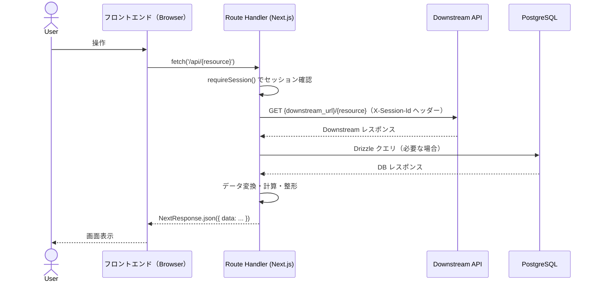
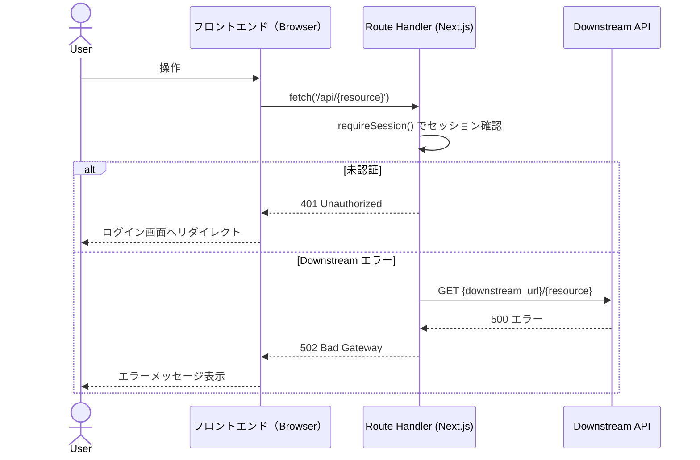

# /planning - Issue 計画コマンド

GitHubのIssueを分析し、設計・影響調査・タスク計画をまとめた `plan.md` を生成します。
生成物は `/dev <issue番号>` コマンドの入力として使用されます。

**使い方**: `/planning <issue_url>`  例: `/planning https://github.com/org/repo/issues/42`

---

## このコマンドが実行するプロセス

```
Step 1: Issue分析                  → 機能概要・受け入れ基準を把握
Step 2: 設計 & APIコントラクト定義  → アーキテクチャ影響範囲・型定義・フロー図
Step 3: BDDシナリオ定義            → Gherkin（UI仕様まで含めた具体的な記述）
Step 4: Downstreamモックデータ設計  → シナリオごとのモックデータを決定
Step 5: 既存機能への影響調査        → 破壊的変更リスクを洗い出す
         ↓ ユーザー確認・承認
Step 6: plan.md 生成               → docs/issues/{issue番号}/plan.md に保存
```

---

## Step 1: Issue 分析

```bash
gh issue view $ARGUMENTS --json number,title,body,labels,assignees,milestone,comments
```

取得した内容から以下を抽出・整理してください。

- **issue番号**: 以降のディレクトリ名に使用する (`docs/issues/{issue番号}/`)
- **機能概要**: 何を実装するか
- **受け入れ基準 (Acceptance Criteria)**: 完了条件のリスト（BDDシナリオ候補）
- **影響範囲**: フロントエンド / BFF Route Handler / 両方 / DB スキーマ / その他
- **非機能要件**: パフォーマンス・セキュリティ・アクセシビリティ等

---

## Step 2: 設計 & APIコントラクト定義

`ARCHITECTURE.md` と `DEVELOPMENT_RULES.md` を参照し、以下を決定してください。

### 2-1. 設計判断

- 新規 Route Handler が必要か → `src/app/api/` のどのパスに追加するか
- 新規ページ・コンポーネントが必要か → フロントエンドのどのディレクトリか
- DB スキーマの変更が必要か → Drizzle スキーマとマイグレーションの追加
- 既存コードへの影響範囲（破壊的変更の有無）

### 2-2. 型・APIコントラクト定義

`src/types/{feature}.ts` に以下を定義します。

```typescript
// BFF → フロントエンドのレスポンス型
export type {Feature}Response = { ... };
export type {Feature}ListResponse = { ... };

// フロントエンド → BFF のリクエスト型
export type Create{Feature}Request = { ... };

// Downstream → BFF の型（内部型）
type Downstream{Feature}Dto = { ... };
```

### 2-3. フロー図の作成

リクエストフローを Mermaid で表現します。

#### シーケンス図（正常系）



#### シーケンス図（異常系）



**ルール**:
- 並列リクエストがある場合は `par` ブロックで表現すること
- 正常系と異常系を必ず別図で描くこと

---

## Step 3: BDDシナリオ定義

受け入れ基準をもとに Gherkin 形式でシナリオを定義します。
各シナリオには **シナリオID（SC-1, SC-2, ...）** を付与します。

### Gherkin の記述レベル

**`.feature` ファイルと `.spec.ts` ファイルで記述レベルを明確に分離してください。**

| ファイル | 対象読者 | 記述レベル | 含めてよいもの |
|---|---|---|---|
| `.feature` | PO・テスター・開発者全員 | **振る舞い（ユーザー視点）** | 操作・期待する状態・表示される文言 |
| `.spec.ts` | 開発者・e2e-agent | **実装詳細（UI コントラクト）** | `data-testid`・内部値・URL・セレクター |

```gherkin
Feature: {機能名}

  Background:
    Given ユーザーがログイン済みである

  @SC-1
  Scenario: {正常系シナリオ名（ユーザーが何を達成できるか）}
    Given {前提条件（ユーザーが見ている状態）}
    When  {ユーザーの操作（ボタン名・リンクテキスト等）}
    Then  {期待する振る舞い（ユーザーが観察できる状態）}
```

```typescript
// @SC-1
test('SC-1: {シナリオ名}', async ({ page }) => {
  // data-testid セレクター・具体的な期待値はここに書く
  await expect(page.locator('[data-testid="feature-card"]')).toHaveCount(5);
});
```

**ルール**:
- 受け入れ基準を1つ残らずシナリオに対応させること
- 正常系・異常系・境界値を網羅すること
- `data-testid` はこの `.spec.ts` がコントラクトとなるため、frontend-agent が実装時に必ず付与する

---

## Step 4: Downstream モックデータ設計

E2E テストは `mock-server.mjs` の Downstream モックに依存します。
各シナリオが期待する具体的なデータを設計してください。

```markdown
## Downstream モックデータ設計

### Service A (port 4001) / Service B (port 4002) のデータ

| フィールド | Service A | Service B | BFF が返す値 | 対応シナリオ |
|---|---|---|---|---|
| {銘柄} price | {値} | {値} | {変換後の値} | SC-X |

### エラー制御
- POST /admin/force-error → エラーモードに切替
- POST /admin/clear-error → エラーモード解除
```

`mock-server.mjs` を実際に確認し、既存データと整合していることを検証してください。

```bash
cat mock-server.mjs
```

---

## Step 5: 既存機能への影響調査

### 調査方針

以下の観点でコードベースを調査し、リスクのある箇所を特定してください。

#### 1. ビジネスロジック・意味的な変更リスク（最重要）

- **新しい値・状態の追加**: 既存の条件分岐でその値が考慮されていないケースはないか
- **集計・一覧の意味変化**: 今回の追加・変更により、既存の一覧取得・集計結果が変わらないか
- **権限・アクセス制御の穴**: 新機能の追加により、認可ルールに抜け穴が生まれないか

#### 2. 型の変更リスク

- 今回追加・変更するフィールドが既存コードから参照されていないか
- `src/types/{feature}.ts` の変更が既存コンポーネントに影響しないか

#### 3. Route Handler の変更リスク

- 今回変更・追加するエンドポイントを既存のフロントエンドコードが利用していないか

#### 4. DB スキーマ変更リスク

- Drizzle スキーマの変更が既存クエリに影響しないか

```bash
grep -rn "{変更対象キーワード}" --include="*.ts" --include="*.tsx" src/
```

---

## Step 6: ユーザー確認 & plan.md 生成

調査結果をユーザーに提示し、**承認を得てから `plan.md` を生成してください**。

提示フォーマット:
```
## 計画サマリー

### 機能概要
{概要}

### BDD シナリオ一覧
| シナリオID | シナリオ名 | 種別 |
|---|---|---|
| SC-1 | ... | 正常系 |
| SC-2 | ... | 異常系 |

### Downstream モックデータ
{追加・変更が必要なデータの概要}

### 既存機能への影響
| リスク | 種別 | 対処方針 |
|---|---|---|

この計画で問題ありませんか？ [yes / 修正内容を記載]
```

ユーザーが **yes** と回答したら、以下のファイルを生成してください。

### 生成するファイル

**`docs/issues/{issue番号}/plan.md`** — `/dev` コマンドが読み込む計画書:

```markdown
# 実装計画 - Issue #{issue番号}: {タイトル}

作成日時: {YYYY-MM-DD}
Issue URL: {url}

## 機能概要

{概要}

## 影響範囲

- [ ] BFF（Route Handler）
- [ ] フロントエンド（Server/Client Component）
- [ ] DB スキーマ（Drizzle）
- [ ] 型定義（`src/types/`）

## APIコントラクト

### Route Handler エンドポイント
| メソッド | パス | 説明 | 認証 |
|---|---|---|---|
| GET | /api/{resource} | ... | 必要 |

### 型定義（`src/types/{feature}.ts`）
（型定義をそのまま記載）

## シーケンス図

### 正常系

\`\`\`mermaid
sequenceDiagram
  %% Step 2-3 で作成した正常系シーケンス図をそのまま貼り付ける
\`\`\`

### 異常系

\`\`\`mermaid
sequenceDiagram
  %% Step 2-3 で作成した異常系シーケンス図をそのまま貼り付ける
\`\`\`

## BDD シナリオ一覧

| シナリオID | シナリオ名 | 種別 |
|---|---|---|
| SC-1 | {名前} | 正常系 |
| SC-2 | {名前} | 異常系 |

### シナリオ詳細（Gherkin）

\`\`\`gherkin
Feature: {機能名}

  Background:
    Given ユーザーがログイン済みである

  @SC-1
  Scenario: {シナリオ名}
    Given ...
    When  ...
    Then  ...
\`\`\`

## Downstream モックデータ設計

| フィールド | Service A | Service B | BFF が返す値 | 対応シナリオ |
|---|---|---|---|---|

### mock-server.mjs への変更
{追加・変更が必要な場合のみ記載。不要なら「変更不要」と記載}

## 既存機能への影響調査結果

### 🔴 High リスク
| 影響機能 | ファイルパス:行 | リスク内容 | 対処方針 |
|---|---|---|---|

### 🟡 Medium リスク
| 影響機能 | ファイルパス:行 | リスク内容 | 対処方針 |
|---|---|---|---|

### 🟢 Low / 影響なし
{影響なしと判断した根拠}

## タスク計画

### Phase A: テストファースト（実装開始前・シナリオごとに実施）
| # | 内容 | 担当エージェント |
|---|---|---|
| A-1 | E2Eテスト先行作成（シナリオ単位） | e2e-agent |

### Phase B: 実装（テスト承認後・シナリオごとに実施）
| # | 内容 | 担当エージェント | 依存 |
|---|---|---|---|
| B-1 | BFF Route Handler 実装 | bff-agent | A-1承認 |
| B-2 | フロントエンド実装 | frontend-agent | A-1承認 |
| B-3 | BFF ユニットテスト | bff-test-agent | B-1 |
| B-4 | フロントエンド ユニットテスト | frontend-test-agent | B-2 |
| B-5 | E2E テスト実行・Pass確認 | e2e-agent | B-1・B-2 |
| B-6 | 内部品質レビュー | code-review-agent | B-1〜B-4 |
| B-7 | セキュリティレビュー | security-review-agent | B-1・B-2 |
```

生成完了後、以下を出力してください。

```
✅ 計画書を生成しました: docs/issues/{issue番号}/plan.md

次のステップ:
  /dev {issue番号}
```
