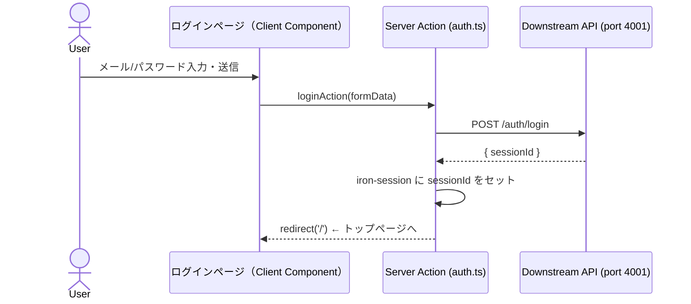
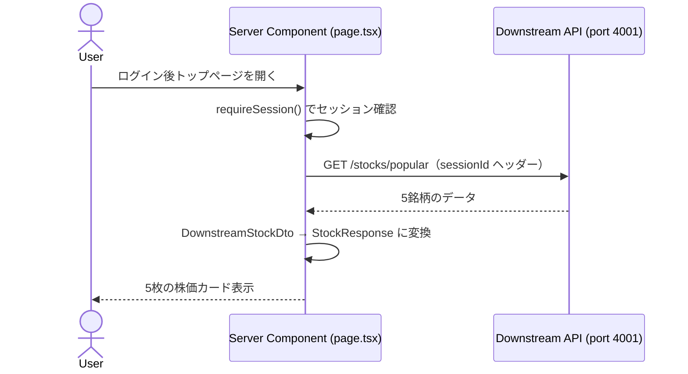
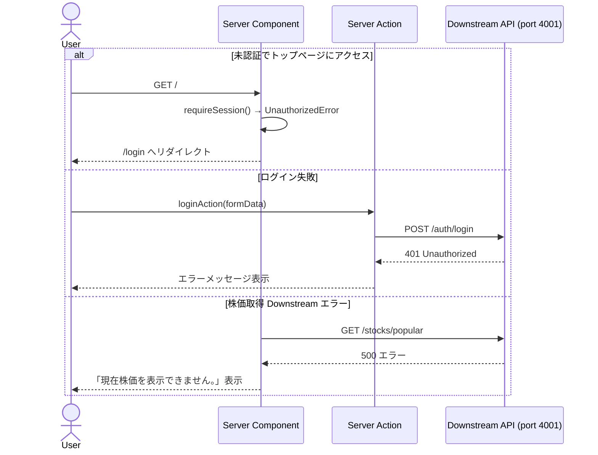

# 実装計画 - Issue #1: ユーザとして人気銘柄の株価を確認する

作成日時: 2026-03-22
Issue URL: https://github.com/sikes-311/SSR-practice/issues/1

## 機能概要

ログイン機能と、ログイン後トップページへの人気上位5銘柄の株価表示を実装する。
各カードには銘柄名・株価・前日比(%)・株価表示日付を表示し、「その他の株価を見る」リンクから株価一覧ページへ遷移できる。APIエラー時はカードの代わりにエラーメッセージを表示する。

## 影響範囲

- [x] フロントエンド（Server/Client Component）
  - `src/app/(auth)/login/page.tsx` — ログインページ（Client Component）
  - `src/app/(app)/layout.tsx` — 認証済みレイアウト（セッションチェック）
  - `src/app/(app)/page.tsx` — トップページ（Server Component、株価表示）
  - `src/app/(app)/stocks/page.tsx` — 株価一覧ページ（プレースホルダー）
- [x] Server Action
  - `src/app/actions/auth.ts` — ログイン Server Action
- [x] Downstream クライアント
  - `src/lib/downstream/auth-client.ts` — 認証 Downstream クライアント
  - `src/lib/downstream/stock-client.ts` — 株価 Downstream クライアント
- [x] 型定義（`src/types/`）
  - `src/types/stock.ts`
- [ ] BFF（Route Handler） — 今回追加なし
- [ ] DB スキーマ（Drizzle） — 変更なし

## APIコントラクト

### Route Handler エンドポイント

今回追加なし。株価取得は Server Component が `lib/downstream/stock-client.ts` を直接呼び出す。ログインは Server Action が `lib/downstream/auth-client.ts` を直接呼び出す。

### 型定義（`src/types/stock.ts`）

```typescript
// BFF → フロントエンド
export type StockResponse = {
  symbol: string;        // 銘柄コード（例: "AAPL"）
  name: string;          // 銘柄名（例: "Apple Inc."）
  price: number;         // 株価
  changePercent: number; // 前日比(%)
  priceDate: string;     // 株価表示日付 (YYYY-MM-DD)
};

export type PopularStocksResponse = {
  stocks: StockResponse[];
};

// 内部型（Downstream → Server Component）
type DownstreamStockDto = {
  symbol: string;
  name: string;
  price: number;
  change_percent: number;
  price_date: string;
};
```

## シーケンス図

### ログイン（正常系）



### 株価表示（正常系）



### 異常系



## BDD シナリオ一覧

| シナリオID | シナリオ名 | 種別 |
|---|---|---|
| SC-1 | 正しい認証情報でログインしてトップページへ遷移できる | 正常系 |
| SC-2 | 誤った認証情報ではログインに失敗しエラーが表示される | 異常系 |
| SC-3 | ログイン後トップページで人気上位5銘柄の株価カードが表示される | 正常系 |
| SC-4 | 各株価カード内に銘柄名・株価・前日比(%)・株価表示日付が表示される | 正常系 |
| SC-5 | 「その他の株価を見る」をタップすると株価一覧ページへ遷移する | 正常系 |
| SC-6 | 株価取得APIエラー時に「現在株価を表示できません。」が表示される | 異常系 |

### シナリオ詳細（Gherkin）

```gherkin
Feature: 人気銘柄の株価確認

  @SC-1
  Scenario: 正しい認証情報でログインしてトップページへ遷移できる
    Given ログインページを開いている
    When 正しいメールアドレスとパスワードを入力してログインボタンを押す
    Then トップページが表示される

  @SC-2
  Scenario: 誤った認証情報ではログインに失敗しエラーが表示される
    Given ログインページを開いている
    When 誤ったパスワードを入力してログインボタンを押す
    Then ログインページにエラーメッセージが表示される

  @SC-3
  Scenario: ログイン後トップページで人気上位5銘柄の株価カードが表示される
    Given ログイン済みである
    When トップページを開く
    Then 株価カードが5枚表示される

  @SC-4
  Scenario: 各株価カード内に銘柄名・株価・前日比(%)・株価表示日付が表示される
    Given ログイン済みである
    When トップページを開く
    Then 各株価カードに銘柄名、株価、前日比(%)、株価表示日付が表示される

  @SC-5
  Scenario: 「その他の株価を見る」をタップすると株価一覧ページへ遷移する
    Given ログイン済みでトップページを開いている
    When 株価カードセクションの「その他の株価を見る」をタップする
    Then 株価一覧ページが表示される

  @SC-6
  Scenario: 株価取得APIエラー時に「現在株価を表示できません。」が表示される
    Given ログイン済みである
    And 株価取得APIがエラーを返す状態になっている
    When トップページを開く
    Then 株価カードの代わりに「現在株価を表示できません。」が表示される
```

```typescript
// SC-1
test('SC-1: 正しい認証情報でログインしてトップページへ遷移できる', async ({ page }) => {
  await page.goto('/login');
  await page.locator('[data-testid="login-email"]').fill('user@example.com');
  await page.locator('[data-testid="login-password"]').fill('password123');
  await page.locator('[data-testid="login-submit"]').click();
  await expect(page).toHaveURL('/');
});

// SC-2
test('SC-2: 誤った認証情報ではログインに失敗しエラーが表示される', async ({ page }) => {
  await page.goto('/login');
  await page.locator('[data-testid="login-email"]').fill('user@example.com');
  await page.locator('[data-testid="login-password"]').fill('wrongpassword');
  await page.locator('[data-testid="login-submit"]').click();
  await expect(page.locator('[data-testid="login-error"]')).toBeVisible();
  await expect(page).toHaveURL('/login');
});

// SC-3
test('SC-3: ログイン後トップページで人気上位5銘柄の株価カードが表示される', async ({ page }) => {
  // ログイン済み状態でアクセス（セッション設定済み）
  await page.goto('/');
  await expect(page.locator('[data-testid="stock-card"]')).toHaveCount(5);
});

// SC-4
test('SC-4: 各株価カード内に銘柄名・株価・前日比(%)・株価表示日付が表示される', async ({ page }) => {
  await page.goto('/');
  const firstCard = page.locator('[data-testid="stock-card"]').first();
  await expect(firstCard.locator('[data-testid="stock-symbol"]')).toBeVisible();
  await expect(firstCard.locator('[data-testid="stock-name"]')).toBeVisible();
  await expect(firstCard.locator('[data-testid="stock-price"]')).toBeVisible();
  await expect(firstCard.locator('[data-testid="stock-change-percent"]')).toBeVisible();
  await expect(firstCard.locator('[data-testid="stock-price-date"]')).toBeVisible();
});

// SC-5
test('SC-5: 「その他の株価を見る」をタップすると株価一覧ページへ遷移する', async ({ page }) => {
  await page.goto('/');
  await page.locator('[data-testid="view-all-stocks"]').click();
  await expect(page).toHaveURL('/stocks');
});

// SC-6
test('SC-6: 株価取得APIエラー時に「現在株価を表示できません。」が表示される', async ({ page }) => {
  // エラーモードを有効化
  await fetch('http://localhost:4001/admin/force-error', { method: 'POST' });
  await page.goto('/');
  await expect(page.locator('[data-testid="stock-error"]')).toBeVisible();
  await expect(page.locator('[data-testid="stock-error"]')).toHaveText('現在株価を表示できません。');
  await expect(page.locator('[data-testid="stock-card"]')).toHaveCount(0);
  // エラーモード解除
  await fetch('http://localhost:4001/admin/clear-error', { method: 'POST' });
});
```

## Downstream モックデータ設計

### Service A (port 4001) のデータ

| エンドポイント | メソッド | レスポンス | 対応シナリオ |
|---|---|---|---|
| `/auth/login` | POST | `{ sessionId: "mock-session-id-abc123" }` | SC-1 |
| `/auth/login`（誤認証） | POST | `401 Unauthorized` | SC-2 |
| `/stocks/popular` | GET | 5銘柄データ（下表） | SC-3〜5 |
| `/stocks/popular`（エラーモード） | GET | `500 Internal Server Error` | SC-6 |

#### 株価モックデータ

| symbol | name | price | change_percent | price_date |
|---|---|---|---|---|
| AAPL | Apple Inc. | 189.50 | 1.25 | 2026-03-21 |
| GOOGL | Alphabet Inc. | 175.30 | -0.45 | 2026-03-21 |
| MSFT | Microsoft Corp. | 425.80 | 0.78 | 2026-03-21 |
| AMZN | Amazon.com Inc. | 198.20 | 2.10 | 2026-03-21 |
| NVDA | NVIDIA Corp. | 875.60 | -1.30 | 2026-03-21 |

### mock-server.mjs への変更

以下のエンドポイントを追加する：

- `POST /auth/login` — メール/パスワードを受け取り、モック sessionId を返す（誤認証は 401）
- `GET /stocks/popular` — 上記5銘柄データを返す

エラーモード制御は既存の `POST /admin/force-error` / `POST /admin/clear-error` を使用（SC-6）。

## 既存機能への影響調査結果

### 🟡 Medium リスク

| 影響機能 | ファイルパス | リスク内容 | 対処方針 |
|---|---|---|---|
| トップページ | `src/app/page.tsx` | Create Next App デフォルトテンプレートを削除して `(auth)/` + `(app)/` 構成に置換が必要 | 削除して再構成 |

### 🟢 Low / 影響なし

既存のビジネスロジックは存在しない（デフォルトテンプレートのみ）。`lib/session.ts` の `requireSession()` は変更なしで利用可能。

## タスク計画

### Phase A: テストファースト（実装開始前）

| # | 内容 | 担当エージェント |
|---|---|---|
| A-1 | mock-server.mjs へのモックデータ追加 + E2E テスト先行作成（SC-1〜6） | e2e-agent |

### Phase B: 実装（A-1 完了後）

| # | 内容 | 担当エージェント | 依存 |
|---|---|---|---|
| B-1 | `(auth)/login/` ページ + `actions/auth.ts` + `lib/downstream/auth-client.ts` 実装 | bff-agent / frontend-agent | A-1 |
| B-2 | `(app)/layout.tsx` + `(app)/page.tsx`（株価表示）+ `lib/downstream/stock-client.ts` 実装 | frontend-agent | A-1 |
| B-3 | フロントエンド ユニットテスト | frontend-test-agent | B-1・B-2 |
| B-4 | E2E テスト実行・Pass 確認 | e2e-agent | B-1・B-2 |
| B-5 | 内部品質レビュー | code-review-agent | B-1〜B-3 |
| B-6 | セキュリティレビュー | security-review-agent | B-1・B-2 |
