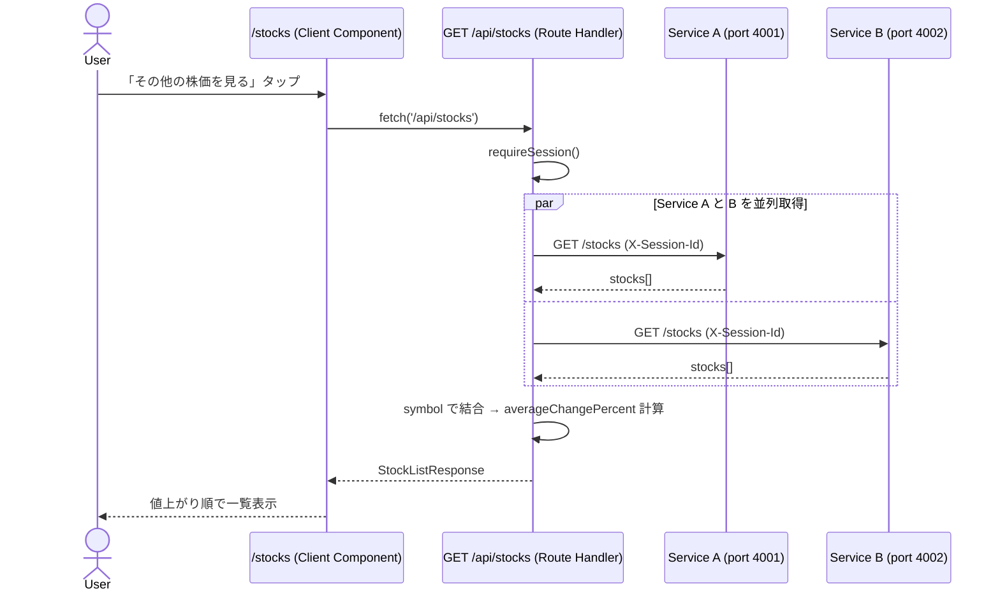
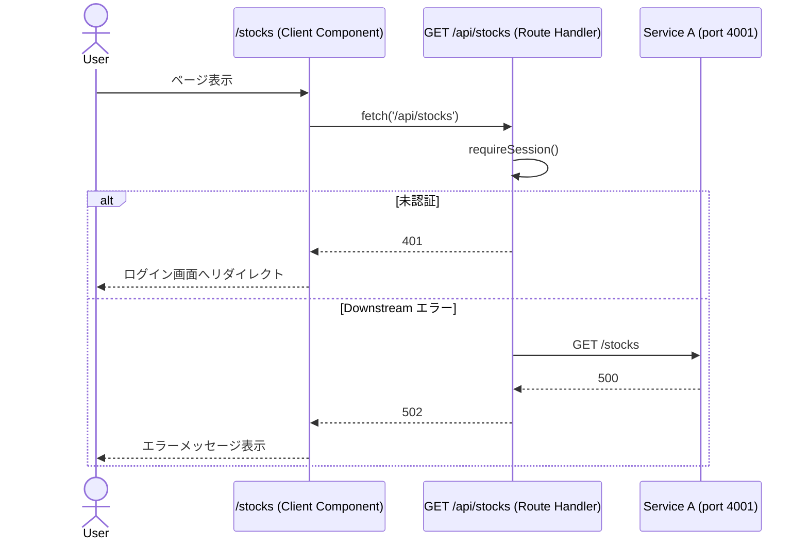

# 実装計画 - Issue #2: ユーザーとして株価チャートの一覧を確認する

作成日時: 2026-03-22
Issue URL: https://github.com/sikes-311/SSR-practice/issues/2

## 機能概要

`/stocks` 株価一覧ページを実装する。
Service A (port 4001) と Service B (port 4002) の両方から全銘柄の前日比データを取得し、
平均値上がり幅を計算した上でリスト表示する。
デフォルトは値上がり順（平均降順）で、ドロップダウンで値下がり順（平均昇順）に切り替えできる。

## 影響範囲

- [x] BFF（Route Handler）— `src/app/api/stocks/route.ts` 新規作成
- [x] フロントエンド（Client Component）— `src/app/(app)/stocks/page.tsx` 実装
- [ ] DB スキーマ（Drizzle）— 変更なし
- [x] 型定義（`src/types/stock.ts`）— `StockListItemResponse` / `StockListResponse` 追加
- [x] Downstream クライアント — `src/lib/downstream/stock-client.ts` に Service B 対応追加
- [x] mock-server.mjs — Service A・B に `/stocks` エンドポイント追加

## APIコントラクト

### Route Handler エンドポイント

| メソッド | パス | 説明 | 認証 |
|---|---|---|---|
| GET | /api/stocks | 全銘柄一覧（Service A+B の平均前日比付き） | 必要 |

### 型定義（`src/types/stock.ts` への追加）

```typescript
export type StockListItemResponse = {
  symbol: string;
  name: string;
  changePercentA: number;        // Service A からの前日比
  changePercentB: number;        // Service B からの前日比
  averageChangePercent: number;  // (A + B) / 2
  priceDate: string;
};

export type StockListResponse = {
  stocks: StockListItemResponse[];
};
```

## シーケンス図

### 正常系



### 異常系



## BDD シナリオ一覧

| シナリオID | シナリオ名 | 種別 |
|---|---|---|
| SC-1 | 株価一覧がデフォルト（値上がり順）で表示される | 正常系 |
| SC-2 | 並び替えドロップダウンで値下がり順に変更できる | 正常系 |
| SC-3 | 株価取得APIエラー時にエラーメッセージが表示される | 異常系 |

### シナリオ詳細（Gherkin）

```gherkin
Feature: 株価一覧の確認と並び替え

  Background:
    Given ユーザーがログイン済みである

  @SC-1
  Scenario: 株価一覧がデフォルト（値上がり順）で表示される
    Given ログイン後のトップページで人気上位5銘柄の株価が表示されている
    When 株価表示カードセクションの右端の「その他の株価を見る」をタップする
    Then 株価一覧ページが表示される
    And 株価カードが1列に表示される
    And 最初のカードが最も値上がり幅の大きい銘柄（トヨタ自動車）である
    And 2番目のカードがソニーグループである
    And 3番目のカードが任天堂である

  @SC-2
  Scenario: 並び替えドロップダウンで値下がり順に変更できる
    Given 株価一覧ページが値上がり順で表示されている
    When 並び替えボタンをタップする
    And 並び替えのドロップダウンから値下がり順を選択する
    Then 最初のカードが最も値下がり幅の大きい銘柄（任天堂）である
    And 2番目のカードがソニーグループである
    And 3番目のカードがトヨタ自動車である

  @SC-3
  Scenario: 株価取得APIエラー時にエラーメッセージが表示される
    Given 株価取得APIがエラーを返す状態になっている
    When 株価一覧ページを開く
    Then 株価カードの代わりにエラーメッセージが表示される
```

## Downstream モックデータ設計

### 期待値（BFF が計算する averageChangePercent）

| 銘柄 | symbol | Service A change_percent | Service B change_percent | averageChangePercent | 値上がり順位 | 値下がり順位 |
|---|---|---|---|---|---|---|
| トヨタ自動車 | TOYOTA | +1.6% | +2.0% | +1.8% | 1位 | 3位 |
| ソニーグループ | SONY | +1.4% | +2.0% | +1.7% | 2位 | 2位 |
| 任天堂 | NINTENDO | -1.4% | +2.0% | +0.3% | 3位 | 1位 |

### mock-server.mjs への変更

**Service A (`mockDataA`) に `allStocks` を追加**:

```javascript
allStocks: {
  stocks: [
    { symbol: "TOYOTA",   name: "トヨタ自動車",   change_percent: 1.6,  price_date: "2026-03-21" },
    { symbol: "SONY",     name: "ソニーグループ",  change_percent: 1.4,  price_date: "2026-03-21" },
    { symbol: "NINTENDO", name: "任天堂",          change_percent: -1.4, price_date: "2026-03-21" },
  ],
},
```

**Service B (`mockDataB`) に `allStocks` を追加**（現在は空）:

```javascript
allStocks: {
  stocks: [
    { symbol: "TOYOTA",   change_percent: 2.0, price_date: "2026-03-21" },
    { symbol: "SONY",     change_percent: 2.0, price_date: "2026-03-21" },
    { symbol: "NINTENDO", change_percent: 2.0, price_date: "2026-03-21" },
  ],
},
```

**両サービスに `GET /stocks` ルートを追加**:

```javascript
if (req.method === "GET" && req.url === "/stocks") {
  res.writeHead(200);
  res.end(JSON.stringify(mockData.allStocks));
  return;
}
```

### エラー制御

既存の `/admin/force-error` / `/admin/clear-error` をそのまま使用（Service A のみで SC-3 をカバー）。

## 既存機能への影響調査結果

### 🔴 High リスク

なし

### 🟡 Medium リスク

| 影響機能 | ファイルパス | リスク内容 | 対処方針 |
|---|---|---|---|
| mock-server.mjs | mock-server.mjs:82-84 | Service B の mockDataB が空のため `/stocks` が 404 になる | `allStocks` データを追加 |

### 🟢 Low / 影響なし

- `src/types/stock.ts` の既存型（`StockResponse`, `PopularStocksResponse`）は変更なし。追加のみ。
- トップページ（`src/app/(app)/page.tsx`）は `getPopularStocks`（Service A の `/stocks/popular`）のみ使用。今回の変更と独立している。
- `stock-client.ts` の既存 `getPopularStocks` 関数は変更なし。新関数を追加するのみ。

## タスク計画

### Phase A: テストファースト（実装開始前）

| # | 内容 | 担当エージェント |
|---|---|---|
| A-1 | E2Eテスト先行作成（SC-1〜SC-3） | e2e-agent |

### Phase B: 実装（テスト承認後）

| # | 内容 | 担当エージェント | 依存 |
|---|---|---|---|
| B-1 | mock-server.mjs に Service A・B の `/stocks` エンドポイント追加 | bff-agent | A-1承認 |
| B-2 | `src/types/stock.ts` に型追加 | bff-agent | A-1承認 |
| B-3 | `src/lib/downstream/stock-client.ts` に `getAllStocks` 追加（Service A・B 両対応） | bff-agent | B-2 |
| B-4 | `src/app/api/stocks/route.ts` 新規作成（BFF: 並列取得・平均計算） | bff-agent | B-3 |
| B-5 | `src/app/(app)/stocks/page.tsx` 実装（Client Component・sort ドロップダウン） | frontend-agent | B-4 |
| B-6 | BFF ユニットテスト | bff-test-agent | B-4 |
| B-7 | フロントエンド ユニットテスト | frontend-test-agent | B-5 |
| B-8 | E2E テスト実行・Pass確認 | e2e-agent | B-4・B-5 |
| B-9 | 内部品質レビュー | code-review-agent | B-4〜B-7 |
| B-10 | セキュリティレビュー | security-review-agent | B-4・B-5 |
