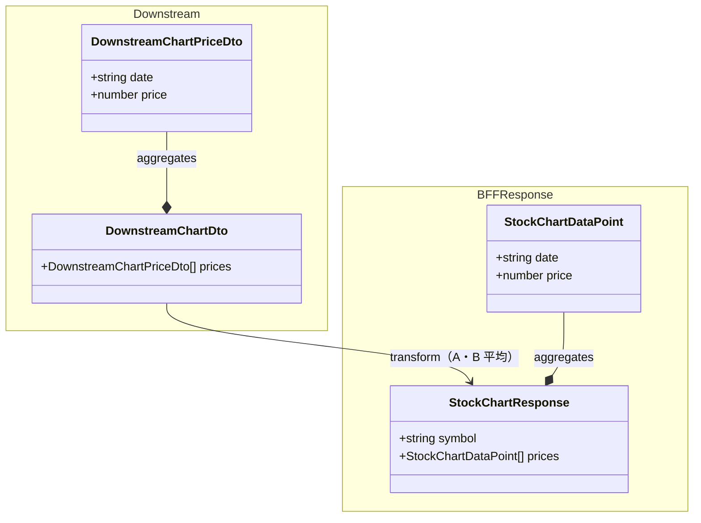
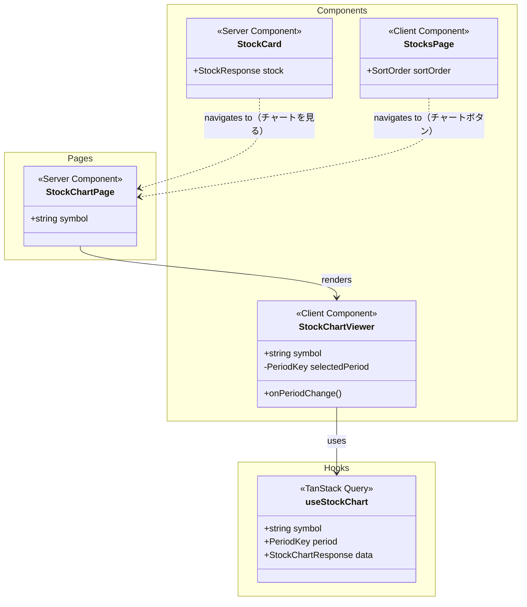
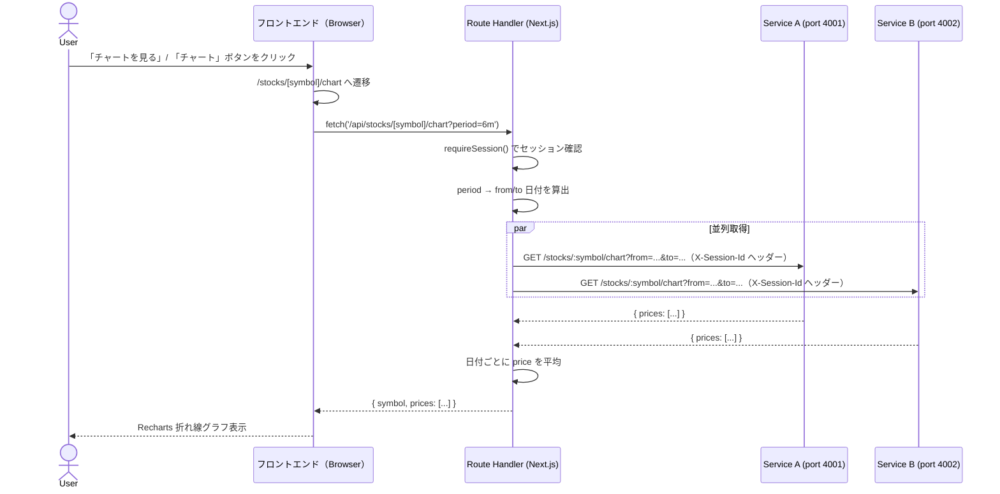
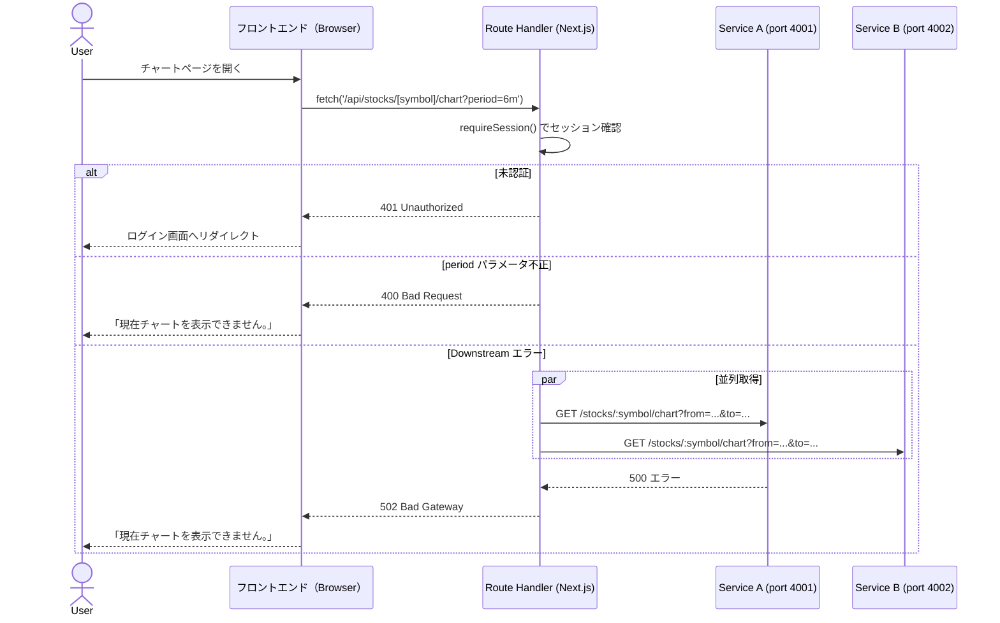

# 実装計画 - Issue #3: ユーザとして銘柄の価格チャートを確認する

作成日時: 2026-03-27
Issue URL: https://github.com/sikes-311/SSR-practice/issues/3

## 機能概要

銘柄ごとの株価チャートページ（`/stocks/[symbol]/chart`）を新設する。

- トップページの人気銘柄カード（`StockCard`）に「チャートを見る」ボタンを追加し、クリックでチャートページへ遷移
- 株価一覧ページ（`/stocks`）の各行に「チャート」ボタンを追加し、クリックでチャートページへ遷移
- チャートページでは Recharts の折れ線グラフで**株価（price）**を表示（X軸: 日付、Y軸: price）
- 期間セレクター（6ヶ月・1年・2年・10年）でインタラクティブに表示期間を切り替え可能。デフォルト: 6ヶ月
- X軸の目盛り形式:
  - 6ヶ月: `yyyy/MM`（月単位）
  - 1年: `yyyy/MM`（2ヶ月単位）
  - 2年: `yyyy/MM`（4ヶ月単位）
  - 10年: `yyyy`（年単位）
- Service A / B 両方から時系列データを取得し、BFF で日付ごとに価格を平均して返す
- ローディング中は「読み込み中...」を表示
- チャート API エラー時は「現在チャートを表示できません。」を表示

### 仕様確認 Q&A

仕様決定の詳細は [`spec-qa.md`](./spec-qa.md) を参照。

## 影響範囲

- [x] BFF（Route Handler）— `src/app/api/stocks/[symbol]/chart/route.ts` 新規追加
- [x] フロントエンド（Server/Client Component）— チャートページ・コンポーネント新規追加、既存コンポーネント変更
- [ ] DB スキーマ（Drizzle）— 変更なし
- [x] 型定義（`src/types/`）— `StockChartDataPoint`, `StockChartResponse` 追加

## API コントラクト

### Route Handler エンドポイント

| メソッド | パス | 説明 | 認証 |
|---|---|---|---|
| GET | `/api/stocks/[symbol]/chart?period=6m\|1y\|2y\|10y` | 銘柄の株価チャートデータ取得 | 必要 |

**クエリパラメータ:**
- `period`: `6m`（デフォルト）/ `1y` / `2y` / `10y`

**成功レスポンス（200）:**
```json
{
  "symbol": "AAPL",
  "prices": [
    { "date": "2025-09-27", "price": 172.5 },
    { "date": "2025-10-27", "price": 175.0 }
  ]
}
```

**エラーレスポンス:**
```json
{ "error": "Unauthorized" }         // 401
{ "error": "Bad Request" }          // 400（period が不正）
{ "error": "Bad Gateway" }          // 502（Downstream エラー）
{ "error": "Internal Server Error" } // 500
```

### Downstream エンドポイント（Service A・B 共通）

`GET /stocks/:symbol/chart?from=YYYY-MM-DD&to=YYYY-MM-DD`

**レスポンス:**
```json
{
  "prices": [
    { "date": "2025-09-27", "price": 170.0 },
    { "date": "2025-10-27", "price": 173.0 }
  ]
}
```

### 型定義（`src/types/stock.ts` 追加分）

```typescript
export type StockChartDataPoint = {
  date: string;   // "YYYY-MM-DD"
  price: number;
};

export type StockChartResponse = {
  symbol: string;
  prices: StockChartDataPoint[];
};
```

## クラス図

### BFF 内部（Downstream DTO → レスポンス型変換）



### フロントエンド コンポーネント構成



## シーケンス図

### 正常系



### 異常系



## BDD シナリオ一覧

| シナリオID | シナリオ名 | 種別 |
|---|---|---|
| SC-1 | トップページの「チャートを見る」からデフォルト6ヶ月チャートが表示される | 正常系 |
| SC-2 | 株価一覧の「チャート」ボタンから株価チャートページが表示される | 正常系 |
| SC-3 | 期間セレクターで表示期間を切り替えるとチャートが更新される | 正常系 |
| SC-4 | チャートAPIエラー時に「現在チャートを表示できません。」が表示される | 異常系 |

### シナリオ詳細（Gherkin）

```gherkin
Feature: 銘柄の株価チャート確認

  Background:
    Given ユーザーがログイン済みである

  @SC-1
  Scenario: トップページの「チャートを見る」からデフォルト6ヶ月チャートが表示される
    Given ログイン後のトップページで人気上位5銘柄の株価が表示されている
    When Apple Inc. の株価カードの「チャートを見る」ボタンをタップする
    Then Apple Inc. の株価チャートページが表示される
    And 表示期間として「6ヶ月」が選択されている
    And 折れ線グラフが表示されている

  @SC-2
  Scenario: 株価一覧の「チャート」ボタンから株価チャートページが表示される
    Given ログイン後のトップページで「その他の株価を見る」をタップして株価一覧ページが表示されている
    When トヨタ自動車の行の「チャート」ボタンをタップする
    Then トヨタ自動車の株価チャートページが表示される
    And 折れ線グラフが表示されている

  @SC-3
  Scenario Outline: 期間セレクターで表示期間を切り替えるとチャートが更新される
    Given Apple Inc. の株価チャートページが表示されている
    When 期間セレクターで「<period>」を選択する
    Then 「<period>」が選択状態になる
    And 折れ線グラフが表示されている

    Examples:
      | period |
      | 6ヶ月  |
      | 1年    |
      | 2年    |
      | 10年   |

  @SC-4
  Scenario: チャートAPIエラー時に「現在チャートを表示できません。」が表示される
    Given チャート情報取得APIがエラーを返す状態になっている
    When Apple Inc. の株価チャートページを開く
    Then 「現在チャートを表示できません。」というエラーメッセージが表示される
    And 折れ線グラフは表示されない
```

### Playwright テストの UI コントラクト（`e2e/stock-chart.spec.ts`）

```typescript
// SC-1
// data-testid="chart-view-button"    — StockCard の「チャートを見る」ボタン
// data-testid="stock-chart-page"     — チャートページのルートコンテナ
// data-testid="period-button-6m"     — 6ヶ月期間ボタン（選択中は aria-pressed="true"）
// data-testid="stock-chart"          — Recharts コンテナ（LineChart）

// SC-2
// data-testid="chart-button"         — 株価一覧の各行の「チャート」ボタン

// SC-3
// data-testid="period-button-6m"     — 6ヶ月
// data-testid="period-button-1y"     — 1年
// data-testid="period-button-2y"     — 2年
// data-testid="period-button-10y"    — 10年

// SC-4
// data-testid="chart-error"          — エラーメッセージ要素
```

## Downstream モックデータ設計

### mock-server.mjs への変更

`GET /stocks/:symbol/chart?from=YYYY-MM-DD&to=YYYY-MM-DD` を Service A・B 両方に追加。

`from`/`to` に基づき月次データポイントを動的生成。

**シンボルごとのベース価格:**

| symbol | Service A basePrice | Service B basePrice | BFF 平均（概算） | 対応シナリオ |
|---|---|---|---|---|
| AAPL | 170 | 180 | 175 | SC-1, SC-3, SC-4 |
| GOOGL | 160 | 165 | 162.5 | SC-3 |
| MSFT | 400 | 410 | 405 | SC-3 |
| AMZN | 180 | 195 | 187.5 | SC-3 |
| NVDA | 800 | 850 | 825 | SC-3 |
| TOYOTA | 1900 | 2000 | 1950 | SC-2, SC-3 |
| SONY | 1500 | 1600 | 1550 | SC-3 |
| NINTENDO | 5000 | 5200 | 5100 | SC-3 |

各ポイントはインデックスごとに小さな増分（+5〜+10/月）を加算してトレンドを再現する。

### エラー制御

既存の `POST /admin/force-error` / `POST /admin/clear-error` をそのまま利用。
SC-4 では Service A のエラーモードを有効化してチャート API エラーを再現する。

## 既存機能への影響調査結果

### 🟡 Medium リスク

| 影響機能 | ファイルパス | リスク内容 | 対処方針 |
|---|---|---|---|
| トップページ人気銘柄表示 | `src/components/features/stock/stock-card.tsx` | 「チャートを見る」ボタン追加により DOM 構造が変わる | 既存 E2E テスト（popular-stocks.spec.ts）で stock-card を参照している箇所を確認・調整 |
| 株価一覧ページ | `src/app/(app)/stocks/page.tsx` | 「チャート」ボタン追加により各行の DOM が変わる | stock-list.spec.ts の SC-1〜3 は名前テキストで検証しており影響は軽微。e2e-agent が調整 |

### 🟢 Low / 影響なし

- `src/types/stock.ts` — 既存型に変更なし（追加のみ）
- `src/lib/downstream/stock-client.ts` — 既存関数に変更なし（追加のみ）
- `src/app/api/stocks/route.ts` — 変更なし
- `src/hooks/use-stock-list.ts` — 変更なし
- DB スキーマ — 変更なし

## タスク計画

### Phase A: テストファースト（実装開始前・シナリオごとに実施）

| # | 内容 | 担当エージェント |
|---|---|---|
| A-1 | E2E テスト先行作成（シナリオ単位） | e2e-agent |

### Phase B: 実装（テスト承認後・シナリオごとに実施）

| # | 内容 | 担当エージェント | 依存 |
|---|---|---|---|
| B-1 | BFF Route Handler 実装（`/api/stocks/[symbol]/chart`・downstream 関数・型定義） | bff-agent | A-1承認 |
| B-2 | フロントエンド実装（チャートページ・StockChartViewer・useStockChart・StockCard/StocksPage 変更） | frontend-agent | A-1承認 |
| B-3 | BFF ユニットテスト | bff-test-agent | B-1 |
| B-4 | フロントエンド ユニットテスト | frontend-test-agent | B-2 |
| B-5 | E2E テスト実行・Pass 確認 | e2e-agent | B-1・B-2 |
| B-6 | 内部品質レビュー | code-review-agent | B-1〜B-4 |
| B-7 | セキュリティレビュー | security-review-agent | B-1・B-2 |
